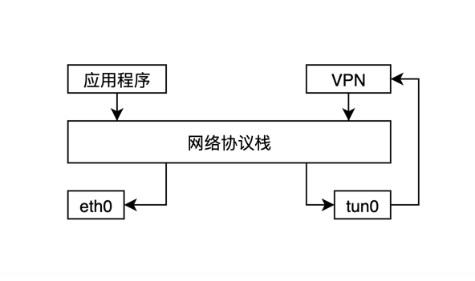
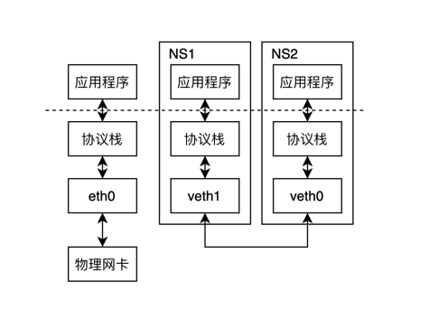
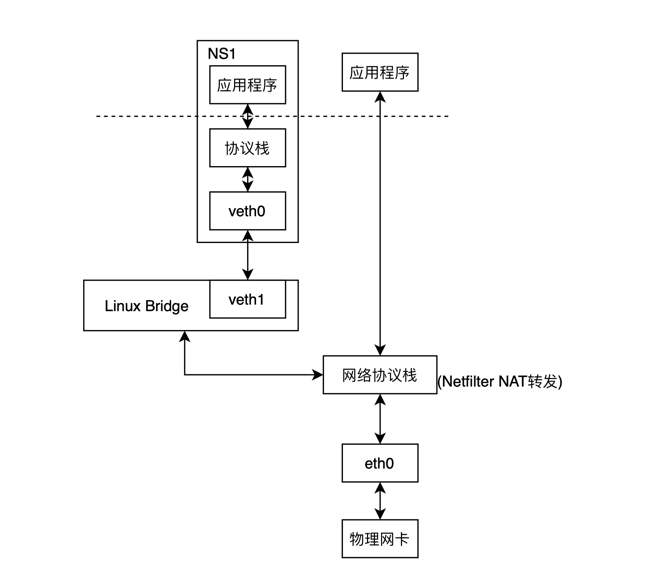

# Linux虚拟网络设备

## 0.章节目标

希望可以通过阅读此文可以：
1. 了解到常用的虚拟网络设备: tun/tap veth bridge.
2. 在宿主机创建网络命名空间来操作这些虚拟网络设备。

## 1. 介绍

随着虚拟化技术、容器化技术的发展，我们在工作中会使用到虚拟化网络技术。简单来说，以往的网卡、交换机、路由器，当前可以通过操作系统使用程序来进行模拟。

| 物理设备| 虚拟设备|
| -----| ------|
| 网卡| tun/tap |
| 网卡| veth pair|
| 交换机 | bridge| 
| 路由器 | Linux Netfilter |

tun用于收发第三层数据报文包，如IP包。因此用用于点对点IP隧道，如OpenVPN，IPSec等。(Linux Kernel 2.1)

tap用于收发第二层数据报文包，如以太网帧。Tap最常见的用途就是做虚拟机的网卡。因为它的普通的物理网卡更加相近，所以也经常用作普通机器的虚拟网卡。(Linux Kernel 2.1)

tun/tap是一端连着网络协议栈，一端连着应用程序，使用tun/tap设备传输数据需要经过两层协议栈，不可避免的对性能有一定损耗。如VPN软件。下图为通过经典VPN例子：



veth是Virtual Ethernet的缩写，是成对儿出现，用于让隔离的网络命名空间通信 (Linux Kernel 2.6 Linux开始支持Net Namespace隔离)。
**直接把veth比喻成网卡不太恰当，它应该相当于交叉网线连接的一对物理网卡。**(交叉网线是指一头是T568A标准，另外一头是T568B标准的网线。直连网线则是两头采用同一种标准的网线。
网卡对网卡这样的同类设备需要使用交叉线序的网线来连接，网卡到交换机、路由器就采用直连线序的网线，不过现在的网卡大多带有线序翻转功能，直连线也可以网卡对网卡地连通了。)




Linux Bridge是Linux Kernel 2.2 版本提供的二层转发工具。可以接入物理网卡，虚拟网卡(tun/tap veth)，Linux Bridge的转发规则也和交换机相同：
```shell
如果数据包是广播帧，转发给所有接入网桥的设备。
如果数据包是单播帧：
    且MAC地址在地址转发表中不存在，则洪泛（Flooding）给所有接入网桥的设备，并将响应设备的接口与MAC地址学习（MAC Learning）到自己的MAC地址转发表中。
    且MAC地址在地址转发表中已存在，则直接转发到地址表中指定的设备。
如果数据包是此前转发过的，又重新发回到此Bridge，说明冗余链路产生了环路。由于以太帧不像IP报文那样有TTL来约束，因此一旦出现环路，
如果没有额外措施来处理的话就会永不停歇地转发下去。对于这种数据包就需要交换机实现生成树协议（Spanning Tree Protocol，STP）来交换拓扑信息，生成唯一拓扑链路以切断环路。
```
生成树协议可以参考参考链接。

Linux Bridge相比于物理交换机不同的一点是，普通交换机只会单纯地做二层转发，Linux Bridge有自身的IP地址，还支持把发给它自身的数据包接入到主机的三层的协议栈中。
比如`docker network`的命令，可以看到它会存在一个gateway的IP地址，这个IP地址可通过宿主机上网络协议栈来将请求进行跨主机转发。Linux内核成了一个天然的路由器
(多亏了Netfilter NAT/SNAT)
```shell
➜  ~ docker network create test-net
a2da028c0d2a66b25065c2a0d19fa596448d6e7f4aaf70f0809568768568d1c5

➜  ~ docker inspect test-net
[
    {
        "Name": "test-net",
        "Id": "a2da028c0d2a66b25065c2a0d19fa596448d6e7f4aaf70f0809568768568d1c5",
        "Created": "2021-05-26T15:53:34.827081035+08:00",
        "Scope": "local",
        "Driver": "bridge",
        "EnableIPv6": false,
        "IPAM": {
            "Driver": "default",
            "Options": {},
            "Config": [
                {
                    "Subnet": "172.18.0.0/16",
                    "Gateway": "172.18.0.1"
                }
            ]
        },
        "Internal": false,
        "Attachable": false,
        "Ingress": false,
        "Containers": {},
        "Options": {},
        "Labels": {}
    }
]
```
在以上处理过程中，Linux主机独立承担了三层路由的职责，一定程度上扮演了路由器的角色。由于有Netfilter的存在，对网络层的路由转发，
就无须像Linux Bridge一样专门提供brctl这样的命令去创建一个虚拟设备，通过Netfilter很容易就能在Linux内核完成根据IP地址进行路由的功能，
你也可以理解为Linux Bridge是一个人工创建的虚拟交换机，而Linux内核则是一个天然的虚拟路由器。

Netfilter是通过NAT规则起到了路由的作用。下图为NS1中的程序通过veth、linux bridge、网络协议栈、eth0，将请求传到网络中。



## 2. 使用

### 2.0 ip命令的使用

下面列出常用的ip相关命令：
```shell
ip-link - network device configuration
ip-address - protocol address management
ip-netns - process network namespace management
```

### 2.1 tun/tap使用
启动tap0和tap1，分别赋值IP，并放在不同的netns中。
```shell
# 添加并启动虚拟网卡tap设备
ip tuntap add dev tap0 mode tap 
ip tuntap add dev tap1 mode tap 
ip link set tap0 up
ip link set tap1 up
# 配置IP
ip addr add 11.0.0.1/24 dev tap0
ip addr add 11.0.0.2/24 dev tap1
# 查看tap,addr可以查看ip,但是link查看不到ip
ip addr show tap0
ip addr show tap1
ip link show tap0
ip link show tap1d

# 添加netns
ip netns add ns0
ip netns add ns1
# 将虚拟网卡tap0，tap1分别移动到ns0和ns1中
ip link set tap0 netns ns0
ip link set tap1 netns ns1
# 将tap移动后需要重启tap 
ip netns exec ns0 ip link set lo up
ip netns exec ns0 ip link set tap0 up
```
tap启动前后通过`ip addr`是可以分辨出来的：
```shell
tap启动前：
[root@test-4 centos]# ip netns exec ns0 ip addr show  tap0
19: tap0: <BROADCAST,MULTICAST> mtu 1500 qdisc pfifo_fast state DOWN group default qlen 1000
    link/ether c6:37:bc:26:76:d0 brd ff:ff:ff:ff:ff:ff
    inet 11.0.0.1/24 scope global tap0
       valid_lft forever preferred_lft forever
tap启动后：
[root@test-4 centos]# ip netns exec ns0 ip addr show  tap0
19: tap0: <NO-CARRIER,BROADCAST,MULTICAST,UP> mtu 1500 qdisc pfifo_fast state DOWN group default qlen 1000
link/ether c6:37:bc:26:76:d0 brd ff:ff:ff:ff:ff:ff
inet 11.0.0.1/24 scope global tap0
valid_lft forever preferred_lft forever
```
在不同的netns中可以进行验证：
```shell
# netns1可以ping 11.0.0.1，但是ping 10.0.0.2 ping不通
[root@fabric-test-4 centos]# ip netns exec ns0 ping 11.0.0.1
PING 11.0.0.1 (11.0.0.1) 56(84) bytes of data.
64 bytes from 11.0.0.1: icmp_seq=1 ttl=64 time=0.139 ms
64 bytes from 11.0.0.1: icmp_seq=2 ttl=64 time=0.069 ms
^C
--- 11.0.0.1 ping statistics ---
2 packets transmitted, 2 received, 0% packet loss, time 1000ms
rtt min/avg/max/mdev = 0.069/0.104/0.139/0.035 ms
[root@fabric-test-4 centos]# ip netns exec ns0 ping 11.0.0.2
PING 11.0.0.2 (11.0.0.2) 56(84) bytes of data.
^C
--- 11.0.0.2 ping statistics ---
3 packets transmitted, 0 received, 100% packet loss, time 2002ms

# netns2可以ping 11.0.0.2，但是ping 10.0.0.1 ping不通
[root@fabric-test-4 centos]# ip netns exec ns1 ping 11.0.0.2
PING 11.0.0.2 (11.0.0.2) 56(84) bytes of data.
64 bytes from 11.0.0.2: icmp_seq=1 ttl=64 time=0.211 ms
64 bytes from 11.0.0.2: icmp_seq=2 ttl=64 time=0.060 ms
64 bytes from 11.0.0.2: icmp_seq=3 ttl=64 time=0.057 ms
^C
--- 11.0.0.2 ping statistics ---
3 packets transmitted, 3 received, 0% packet loss, time 1999ms
rtt min/avg/max/mdev = 0.057/0.109/0.211/0.072 ms
[root@fabric-test-4 centos]# ip netns exec ns1 ping 11.0.0.1
PING 11.0.0.1 (11.0.0.1) 56(84) bytes of data.
^C
--- 11.0.0.1 ping statistics ---
2 packets transmitted, 0 received, 100% packet loss, time 999ms
```

### 2.2 veth pair使用
```shell
# 创建一对veth
ip link add veth0 type veth peer name veth1
# 将veth移动到netns中
ip link set veth0 netns ns0
ip link set veth1 netns ns1
# 启动
ip netns exec ns0 ip link set veth0 up
ip netns exec ns1 ip link set veth1 up
# 查看路由

 
Kernel IP routing table
Destination     Gateway         Genmask         Flags Metric Ref    Use Iface
11.0.0.0        0.0.0.0         255.255.255.0   U     0      0        0 tap0
# 如果这时候执行 ip netns exec ns0 ping 11.0.0.2 肯定是ping不通的，因为走的tap0虚拟网卡
# 所以需要修改路由
ip netns exec ns0 ip route change 11.0.0.0/24 via 0.0.0.0 dev veth0
ip netns exec ns1 ip route change 11.0.0.0/24 via 0.0.0.0 dev veth1
#再次查看ns0路由 
ip netns exec ns0 route
Kernel IP routing table
Destination     Gateway         Genmask         Flags Metric Ref    Use Iface
11.0.0.0        0.0.0.0         255.255.255.0   U     0      0        0 veth0
# 更新了路由，现在可以ping通了
ip netns exec ns0 ping 11.0.0.2
PING 11.0.0.2 (11.0.0.2) 56(84) bytes of data.
64 bytes from 11.0.0.2: icmp_seq=1 ttl=64 time=0.196 ms
64 bytes from 11.0.0.2: icmp_seq=2 ttl=64 time=0.070 ms
^C
--- 11.0.0.2 ping statistics ---
2 packets transmitted, 2 received, 0% packet loss, time 999ms
rtt min/avg/max/mdev = 0.070/0.133/0.196/0.063 ms
```
如此使用veth pair进行点对点连接是有问题的，当节点数变多的时候，就很麻烦。所以出现了网桥(linux bridge)

### 2.3 linux bridge使用(net namespace)
可以使用bridge-utils来对linux bridge进行管理。
```shell
# centos
yum install -y bridge-utils
# ubuntu
apt-get install -y bridge-utils
```
brctl的基本命令：
```shell
#查看bridge
brctl show
#新增bridge
brctl add <br-name>
#新增一个设备到网桥
brctl addif <bridge> eth0
#启动网桥
ip link set <bridge> up
#关闭网桥，删除网桥,只有关闭的网桥才能被删除
ip link set <bridge> down
brctl delbr <bridge>
```
连通性实验：
```shell

# 添加网桥
brctl addbr br0
# 启动网桥
ip link set br0 up
#可以通过此给网桥设置ip，这里不需要
#ip addr add 12.0.0.1/24 dev br0

# 新增三个netns
ip netns add ns0
ip netns add ns1
ip netns add ns2

# 新增两对veth
ip link add veth0-ns type veth peer name veth0-br
ip link add veth1-ns type veth peer name veth1-br
ip link add veth2-ns type veth peer name veth2-br

# 将veth的一端移动到netns中
ip link set veth0-ns netns ns0
ip link set veth1-ns netns ns1
ip link set veth2-ns netns ns2

# 将netns中的本地环回和veth启动并配置IP
ip netns exec ns0 ip link set lo up
ip netns exec ns0 ip link set veth0-ns up
ip netns exec ns0 ip addr add 11.0.0.1/24 dev veth0-ns

ip netns exec ns1 ip link set lo up
ip netns exec ns1 ip link set veth1-ns up
ip netns exec ns1 ip addr add 11.0.0.2/24 dev veth1-ns

ip netns exec ns2 ip link set lo up
ip netns exec ns2 ip link set veth2-ns up
ip netns exec ns2 ip addr add 11.0.0.3/24 dev veth2-ns

# 将veth的另一端启动并挂载到网桥上
ip link set veth0-br up
ip link set veth1-br up
ip link set veth2-br up
brctl addif br0 veth0-br
brctl addif br0 veth1-br
brctl addif br0 veth2-br

#连通性测试
ip netns exec ns0 ping 11.0.0.1
ip netns exec ns0 ping 11.0.0.2
ip netns exec ns0 ping 11.0.0.3
```

## 3. 最佳实践

### 3.1 链路分析


### 3.2 docker的网络实践
//todo 了解下docker是如何做的

### 3.3 kubernetes的网络实践
//todo 了解下kubernetes是如何做的

## 4. 原理分析


## 99. 相关参考

[STP,生成协议树](https://en.wikipedia.org/wiki/Spanning_Tree_Protocol)
[凤凰架构](http://icyfenix.cn/immutable-infrastructure/network/linux-vnet.html#%E8%99%9A%E6%8B%9F%E5%8C%96%E7%BD%91%E7%BB%9C%E8%AE%BE%E5%A4%87)
[虚拟网络设备相关博客](https://typesafe.cn/posts/)
[给docker添加网卡](https://typesafe.cn/posts/how-to-add-port-for-docker/)